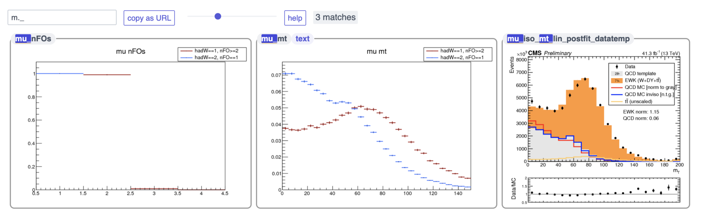

## niceplots

### Example




This is a single file PHP script that you can drop into a directory full of images to nicely
format them on a page so that they are searchable and sortable. Searching supports **live regex**.
Some **Vim keybindings** are also provided. Oh, there's also a **dark mode**, even for the images.

By default, browser-friendly images (png, svg, gif) are displayed, and if a pdf version of the file
(same name but with "pdf" as the extension) exists, the images are links to those.

### "Installation"

#### With a web server 

Just copy `index.php` into a PHP-supporting web directory with images.

#### Locally

Convert `index.php` into a static `index.html` and open it in your browser:
```bash
cd testplots
php ../index.php > index.html
open index.html
```

If you need extra features like `.txt`, `.json` below, you can use python's `SimpleHTTPServer`
to serve up the page and bypass the CORS policy:
```bash
cd testplots
php ../index.php > index.html
python -m SimpleHTTPServer # or `python -m http.server` if python3
# visit http://localhost:8000/ in your browser
```

### Features

* regex searching with live pattern matching for instant feedback
  * patterns are case-insensitive until an upper-case character is typed (vim `set smartcase`)

* dark mode and super-saturation mode (to make colors _pop_)

* tree-viewer (supporting shift click for multiple selection/filtering, through `jstree`) becomes
available when there is at least one subdirectory with content

* copy URL (+search patterns) to clipboard

* zoomable plots

* vim-like keybindings 
  * `g`/`G` to go to top/bottom
  * `/` to focus the search box
  * `y` to copy the contents as a URL
  * `s`/`S` to sort A-Z/Z-A
  * `b` to toggle super-saturation mode
  * `m` to toggle dark mode
  * `x` to toggle image visibility

The are also some features to display/link auxiliary content.

* if a `description.txt` file is found inside the folder with images, the contents are displayed (as HTML)
at the top of the final page.
  * if an image name (sans extension) shows up in the description, it is highlighted and becomes a link to the corresponding image

* if files with the same name as the image, but extensions of `txt`, `extra`, `json` are found, they become links
  * hovering over links for `txt` and `extra` will show the contents in a transient overlay at the bottom of the page

#### Helper script for image conversion

You'll might have a bunch of pdf images from a script and want to (1)
convert them all to embeddable png files and (2) upload them to a directory
with this niceplots index page.  That's where `misc/niceplots.sh` comes in. Note that
this script is basically a template, as these operations are highly dependent
upon your configuration/computer, so assume you will need to modify many parts.

